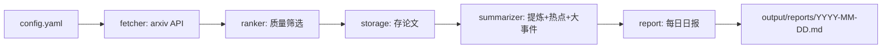

# 每日论文总结应用

## 目标
按 `readme.md` 需求，实现一个每日定时任务：抓取 arxiv 上匹配默认关键词的高质量论文 → 存到指定文件夹 → 提炼汇总 → 生成含“每日热点 + 大事件”的日报。

## 技术栈与默认决策
- 语言：Python 3.10+
- 抓取：arxiv 官方 API（`http://export.arxiv.org/api/query`）+ `feedparser` 解析
- 定时：`APScheduler`（也支持 `--once` 手动跑一次 / 交给系统 cron）
- 汇总：默认调用 OpenAI 兼容 API（`openai` SDK，`base_url`/`api_key`/`model` 全部走环境变量，兼容 OpenAI/DeepSeek/通义等）；**无 API Key 时自动降级为规则模式**（abstract 摘录 + 关键词词频统计热点），保证离线可运行

## 目录结构
```
paper_reading_cursor/
├── readme.md
├── requirements.txt
├── config.yaml            # 搜索关键词、类别、数量、定时、输出路径等
├── .env.example           # LLM API 配置示例
├── main.py                # 入口：--once / 定时守护
└── paper_reading/
    ├── __init__.py
    ├── config.py          # 读取 config.yaml + 环境变量
    ├── models.py          # Paper 数据类
    ├── fetcher.py         # arxiv 抓取 + 关键词匹配
    ├── ranker.py          # 质量筛选/打分（高质量论文）
    ├── storage.py         # 按日期存论文（json + md）
    ├── summarizer.py      # LLM/规则 双模式提炼与热点/大事件汇总
    ├── report.py          # 生成每日 Markdown 日报
    └── pipeline.py        # 串联 抓取→筛选→存储→汇总→日报
```

## 数据流


## 关键实现点
- `fetcher.py`：按 `config` 中每个关键词构造 arxiv query（限定类别如 `cs.AI/cs.CL/cs.LG`，按 `submittedDate` 倒序），抓取近 N 天结果，解析标题/作者/摘要/分类/链接/日期，按 arxiv id 去重。
- `ranker.py`：对“高质量”给出可解释打分（关键词命中数、是否有代码/项目链接、类别权重、更新时间新鲜度等），取 Top-K；阈值和权重放 config。
- `storage.py`：输出到 `output/papers/YYYY-MM-DD/`，每篇存结构化 `json`，并汇总一个当日 `papers.md`；重复运行幂等。
- `summarizer.py`：
  - LLM 模式：对每篇论文生成中文一句话提炼；对全天论文生成“研究热点(聚类关键词/主题)”与“重要大事件(突破性/高关注工作)”。
  - 规则模式：一句话提炼取摘要首句；热点用标题/摘要关键词词频 Top-N；大事件取综合分最高的几篇。
- `report.py`：生成 `output/reports/YYYY-MM-DD.md`，含 概览统计 / 今日热点 / 重要大事件 / 论文清单（标题+提炼+链接）。
- `main.py`：`python main.py --once` 立即跑；无参数则用 APScheduler 每天 `config.schedule.time` 定时执行。

## 配置项（config.yaml 草案）
- `keywords`: 默认词条（如 `["large language model", "agent", "retrieval augmented"]`）
- `categories`: arxiv 类别（默认 `cs.AI, cs.CL, cs.LG`）
- `days_back` / `max_results` / `top_k`
- `output_dir`
- `schedule.time`（如 `08:00`）
- LLM：`OPENAI_API_KEY` / `OPENAI_BASE_URL` / `OPENAI_MODEL`（环境变量，`.env.example` 提供）

## 交付后验证
- `pip install -r requirements.txt`
- `python main.py --once` 跑通一次，在 `output/` 生成当日论文与日报（无 Key 时走规则模式）。