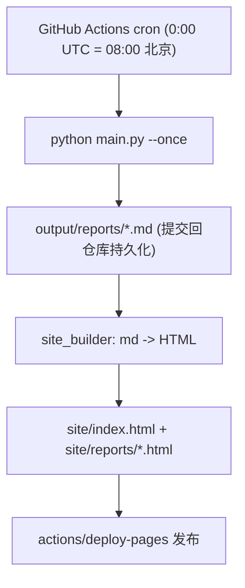

# 论文日报网站化与自动部署

## 目标
在已实现的 arxiv 抓取 + 日报生成基础上，新增：
1. 静态 HTML 网站生成（首页展示最新日报 + 历史归档列表，可点进每天详情）。
2. GitHub Actions 定时任务：每天北京时间 08:00 自动抓取、生成站点、发布到 GitHub Pages。
3. 文档化后续迁移到服务器的方案。

## 架构与数据流

关键点：Actions 运行环境是临时的，历史归档靠把 `output/` 下的 Markdown 报告 commit 回仓库来持久化；每次运行时站点由仓库里所有历史报告重新构建，保证归档不丢。

## 具体改动

### 1. 新增 HTML 站点构建 `paper_reading/site_builder.py`
- `build_site(output_dir: Path, site_dir: Path)`：
  - 扫描 `output/reports/*.md`，按日期倒序。
  - 用 `markdown` 库把每篇 md 转成 HTML，套用统一模板写到 `site/reports/YYYY-MM-DD.html`。
  - 生成 `site/index.html`：顶部内嵌最新一天日报内容，下方“历史归档”列出所有日期链接（指向 `reports/*.html`）。
  - 生成 `site/assets/style.css`（简洁现代、移动端友好的样式）。
  - 幂等：每次全量重建 `site/`。

### 2. 接入 pipeline
- 在 [paper_reading/pipeline.py](paper_reading/pipeline.py) 的 `run_pipeline` 末尾调用 `build_site`，把站点输出到 `config` 新增的 `site_dir`（默认项目根 `site/`）。
- [paper_reading/config.py](paper_reading/config.py) 增加 `site_dir` 配置项；[config.yaml](config.yaml) 增加 `site_dir: site`。

### 3. 依赖
- [requirements.txt](requirements.txt) 增加 `markdown`。

### 4. GitHub Actions 工作流 `.github/workflows/daily.yml`
- 触发：`schedule: cron "0 0 * * *"`（08:00 北京）+ `workflow_dispatch`（手动触发）。
- 步骤：
  1. `actions/checkout`
  2. `actions/setup-python`（3.11）+ `pip install -r requirements.txt`
  3. `python main.py --once`（规则模式，无需密钥）
  4. 用 `stefanzweifel/git-auto-commit-action` 把新增的 `output/` 提交回仓库（持久化历史）
  5. `actions/upload-pages-artifact`（上传 `site/`）
  6. `actions/deploy-pages` 发布
- 权限：`permissions: contents: write, pages: write, id-token: write`；并发 `concurrency: pages`。

### 5. 文档 `readme.md` 更新
- 本地运行、GitHub Pages 部署步骤（仓库 Settings -> Pages -> Source 选 GitHub Actions）。
- 阶段二：迁移到服务器（用系统 crontab `0 8 * * *` 调 `python main.py --once`，或常驻 `python main.py` 用内置 APScheduler；站点用 nginx / `python -m http.server` 托管 `site/` 目录）。

## 默认决策（已与用户确认）
- 站点结构：首页 + 历史归档。
- CI 汇总：规则模式，无需 API Key（后续需要可加 GitHub Secret 走 LLM 模式）。
- 定时：cron `0 0 * * *`（08:00 北京时间）。

## 验证
- 本地 `python main.py --once` 后检查 `site/index.html` 与 `site/reports/*.html` 正常。
- Push 后在 Actions 手动触发一次 `workflow_dispatch`，确认 Pages 发布成功、历史 md 已提交回仓库。